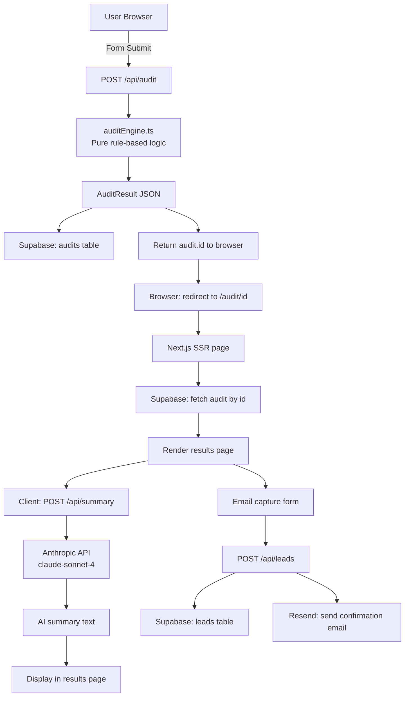

# Architecture

## System Diagram

## Data Flow

1. **Input → Audit**: User fills the form. On submit, the browser POSTs `AuditInput` (tools[], teamSize, useCase) to `/api/audit`. The route calls `runAudit()` from `lib/auditEngine.ts` — pure TypeScript, no external calls. Result is stored in Supabase and the generated `id` is returned.

2. **Audit → Results page**: Browser redirects to `/audit/[id]`. Next.js fetches the audit server-side (SSR) for proper OG metadata. The client component then fires a parallel request to `/api/summary` for the AI narrative.

3. **Summary generation**: `/api/summary` calls the Anthropic `claude-sonnet-4` model with a structured prompt. On any API failure (429, 500, timeout), it falls back to a deterministic templated summary derived from the audit data.

4. **Lead capture**: After results are shown, the user optionally enters their email. `/api/leads` stores in Supabase and sends a transactional email via Resend. High-savings leads ($500+/mo) get a Credex CTA in the email.

5. **Sharing**: Each audit has a permanent public URL at `/audit/[id]`. OG tags are generated server-side with actual savings numbers. The public page strips identifying info (email, company name) — only tool names and savings numbers are visible.

## Stack Justification

| Layer | Choice | Why |
|-------|--------|-----|
| Framework | Next.js 14 (App Router) | SSR for OG tags, API routes for backend, single deploy |
| Language | TypeScript | Type safety catches pricing/logic bugs at compile time |
| Styling | Tailwind CSS | Utility-first, no runtime overhead, easy responsive layout |
| DB | Supabase (Postgres) | Free tier, real Postgres, good DX, non-technical dashboard |
| Email | Resend | Cleanest DX, free tier sufficient for MVP |
| AI | Anthropic API | Assignment requirement; claude-sonnet-4 is cost-efficient |
| Deploy | Vercel | Zero-config Next.js, edge functions, free tier generous |

## Scaling to 10k audits/day

Current bottlenecks at that volume:

1. **Rate limiting**: In-memory rate limiter doesn't survive restarts or scale horizontally. Replace with Upstash Redis + `@upstash/ratelimit`.

2. **Supabase free tier**: At 10k audits/day, storage and API calls would exceed free tier. Upgrade to Pro ($25/mo) or self-host Postgres on Render.

3. **AI summary**: 10k summaries/day at ~200 tokens each = 2M tokens. At Sonnet pricing this is manageable (~$3/day), but add a queue (BullMQ or Vercel Queue) to prevent thundering herd on the Anthropic API.

4. **OG image generation**: Currently URL-encoded parameters. At scale, pre-generate and cache in Cloudflare R2.

5. **Analytics**: Add PostHog or Plausible to track funnel: form load → audit completed → email captured → Credex CTA clicked.
